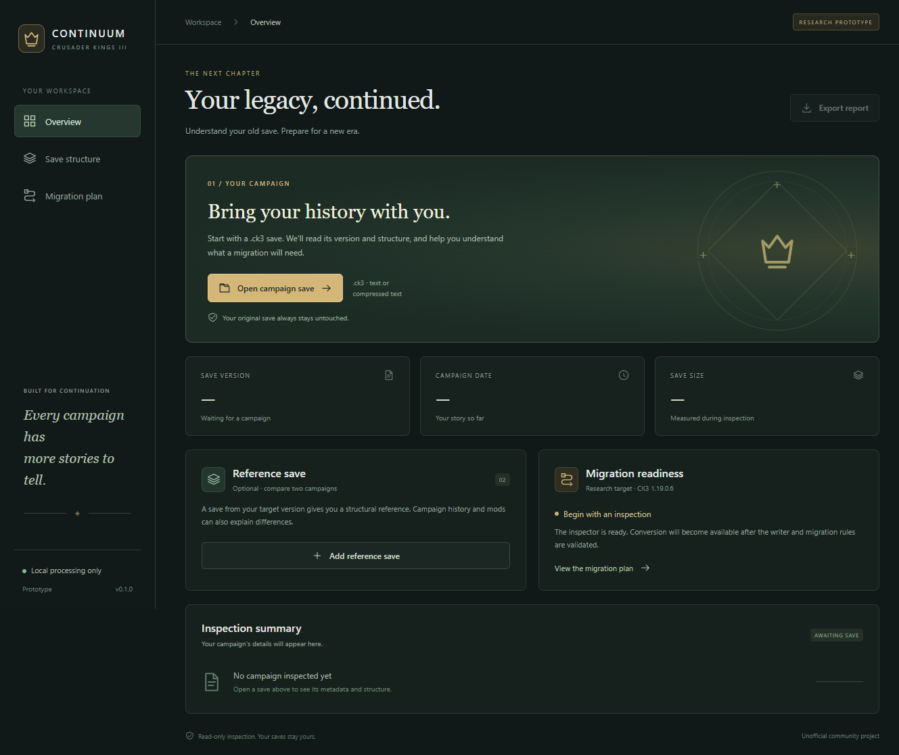

# CK3 Continuum

Version 0.3.1 adds experimental random regional kingdoms for newly introduced map regions, with a required target-version reference. v0.3.1 corrects the first-tick regiment crash found in v0.3.0. See [the migration details and limits](docs/random-regions.md).


A Svelte + Electron desktop prototype for inspecting Crusader Kings III saves and researching campaign migration. Heavy save parsing runs in Rust through Jomini and napi-rs.




## What you can do

- Open a local `.ck3` campaign using the desktop file picker.
- Read embedded version, campaign metadata, file sizes, and section inventories.
- Inspect text and supported compressed-text saves, with ZIP CRC/size verification.
- Add a reference save and compare immediate-entry counts and root occurrences.
- Search sections and inspect ordered scalar metadata.
- Export a JSON inspection report to a new filename.
- Cancel an inspection by terminating its isolated utility process.
- Create an experimental conversion or writer-control save with a change journal.
- Review the migration roadmap and current limitations.

Everything runs locally. The app has no uploads, analytics, accounts, or automatic updates. Exported reports contain save filenames and campaign metadata; review them before sharing. Absolute input paths are not included in reports.

## Run from source (Windows x64)

Install Node.js **24 LTS** (or a compatible Node >=22.12), Rust **1.94.0+** with the MSVC toolchain, and Visual Studio Build Tools with **Desktop development with C++** and a Windows SDK.

From this directory:

```powershell
npm ci
npm run native:build
npm run build
npm start
```

For development with Svelte hot reload, use `npm run dev` after building the native module. Restart the dev command after changing Electron files. `npm run dev:ui` provides a browser-only UI preview with local-file operations disabled.

The reviewed Jomini source is vendored in `vendor/jomini`; no sibling Desktop folders, CK3 installation, real saves, Python runtime, or globally installed frontend tools are required. Cargo and npm still download locked dependencies on a clean build. The native build checks the Jomini source fingerprint before compilation.

## Build a Windows application

```powershell
npm run package
```

This produces an unsigned Windows x64 ZIP under `release-0.2.1/`. Extract the entire ZIP and run **CK3 Continuum.exe**. End users need neither Node nor Rust. Keep the executable with its resource files.

For an unpacked build, use `npm run package:dir`. The native addon is shipped outside ASAR through Electron Builder's `extraResources`. Linux, macOS, ARM, code signing, installers, and automatic updates are not configured or tested.

## Verify

```powershell
npm test
npm run test:desktop
```

Build the native module and frontend first. Tests cover parser failure modes, CRC, limits, duplicates, scoped conversion, exact round trips, schema conflicts, stale sources, and overwrite protection. The desktop smoke launches real Electron with synthetic saves, exercises the isolated preload bridge, file dialogs (programmatically selected), native process, comparison, export, conversion, cancellation, existing-file rejection, and recovery from invalid input. Screenshots and test outputs stay in ignored `test-output/` folders.

Optionally exercise the research pair without copying it into the repository:

```powershell
npm run test:desktop -- "C:\path\old-1.16.1.ck3" "C:\path\reference-1.19.ck3"
```

That research smoke expects embedded source version 1.16.1. It verifies original hashes before and after, not engine compatibility.

To smoke-test an unpacked package, set `CONTINUUM_EXE` to its executable, run `npm run test:desktop`, then remove that environment variable.

## Architecture

```text
src/                  Svelte + TypeScript UI
electron/             Main process, sandboxed preload, inspection utility, report writer
native/               Rust cdylib + napi-rs CJS/ESM bindings
vendor/jomini/        Reviewed Jomini 0.35.0 source and license
scripts/              Development, launch, and desktop smoke tools
tests/                Report integrity and overwrite tests
.github/workflows/    Windows build/test/package CI
docs/                 Architecture, migration milestones, validation notes
```

The renderer has no Node APIs and cannot supply arbitrary filesystem paths. Main-process dialogs choose files; narrow IPC handlers validate the sender and arguments. Each scan gets its own utility process, preserving UI responsiveness and allowing cancellation/crash isolation. The addon returns bounded summaries rather than the whole gamestate.

See [architecture](docs/architecture.md), [migration roadmap](docs/roadmap.md), and [validation](docs/validation.md).

## GitHub readiness

This folder is the repository root. It includes a lockfile, Rust lockfile, CI, contribution notes, MIT license, and third-party notices. Saves, reports, generated native binaries, build output, dependency directories, and local profiles are ignored. CI uses synthetic fixtures and requires no private campaign files.

No GitHub repository or remote is created automatically. Create an empty repository, add its remote here, and push when ready. Do not commit proprietary game definitions or private saves.

This is an unofficial community project, unaffiliated with Paradox Interactive. CK3 and its game assets belong to their respective owners. Project code is MIT-licensed; dependency licenses remain separate. See [third-party notices](THIRD_PARTY_NOTICES.md).
