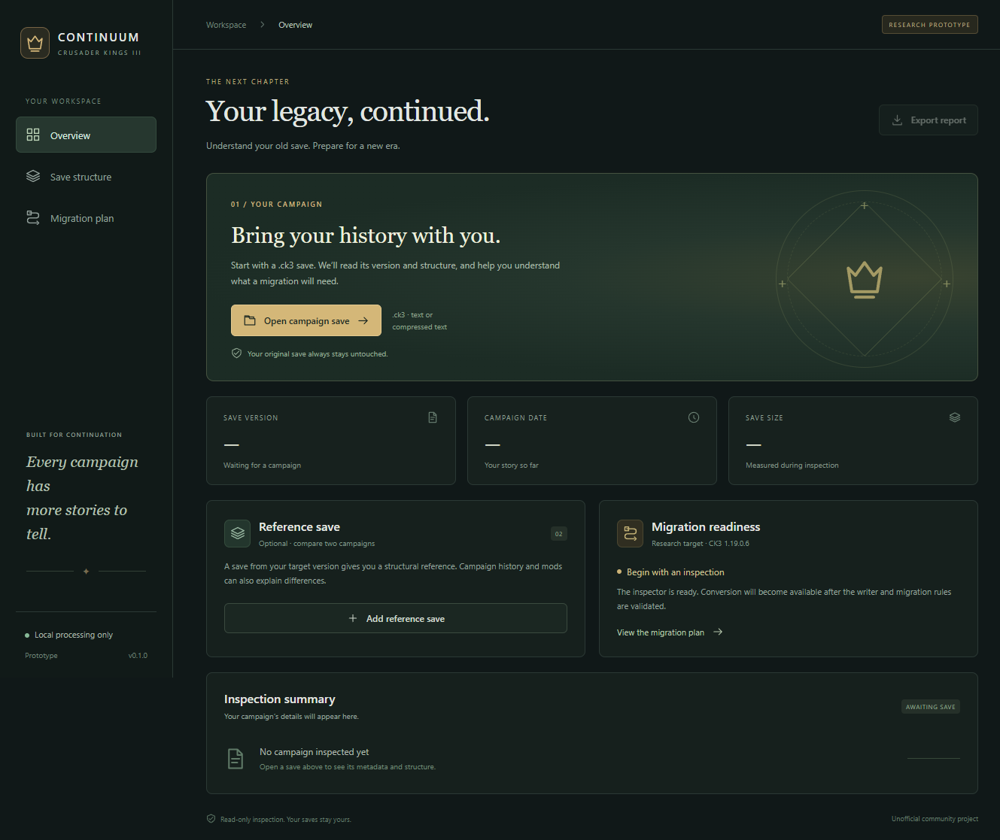

# CK3 Continuum

A local desktop tool for inspecting Crusader Kings III saves and experimenting with moving an existing campaign to a newer game version.

## Quick links

- [Download releases](https://github.com/skonester/CK3-Continuum/releases)
- [Download and run](#download-and-run-windows-x64)
- [Use your old save with a reference](#use-your-old-save-with-a-reference)
- [Included reference save](#included-reference-save)
- [Why this exists](#why-this-exists)
- [Compatibility and current limits](#compatibility-and-current-limits)
- [What you can do](#what-you-can-do)
- [Future scope: AGOT and other mods](#future-scope-agot-and-other-mods)
- [Run from source](#run-from-source-windows-x64)
- [Build a Windows application](#build-a-windows-application)
- [Verify](#verify)
- [Architecture](#architecture)
- [Migration roadmap](docs/roadmap.md)
- [Validation results](docs/validation.md)
- [Report an issue](https://github.com/skonester/CK3-Continuum/issues)

## Download and run (Windows x64)

1. Open the [Releases page](https://github.com/skonester/CK3-Continuum/releases) and choose a release with a Windows build.
2. Download the `CK3-Continuum-<version>-win-x64.exe` asset.
3. Run the downloaded **.exe**. No installation or separate resource folder is needed.

The portable executable includes Electron, the native parser, and the app resources. You do not need Node.js or Rust installed. It extracts its bundled files to a temporary directory when launched. Builds are unsigned and currently target Windows x64.

For builds downloaded from GitHub Actions, extract the artifact download ZIP to get the single portable `.exe`.

## Use your old save with a reference

**You need two saves for the default conversion: your old campaign and a freshly saved new game from the version you want to play. Without a matching reference save, the default conversion will not work and the Convert save button stays disabled.** Opening and inspecting an old save alone still works.

The conversion profiles support these experimental paths:

| Campaign version | Target version | Reference |
| --- | --- | --- |
| 1.16.1 through 1.18.x | 1.19.0.6 | Fresh 1.19.0.6 save for new regions |
| 1.19.0.6 | 1.20.0.3 | Fresh 1.20.0.3 save with matching province IDs |

The older profiles remain available. The new **1.19.0.6 → 1.20.0.3** profile migrates faiths and rites while preserving campaign IDs; it has been checked against the supplied Barbara and Murchad saves, but has **not been tested inside CK3**. See [the 1.20 migration details](docs/migration-1.20.md). Installing a later CK3 release does not automatically make it a supported target.

1. **Keep your old campaign save.** This is the source campaign you want to continue.
2. **Create a fresh reference in CK3.** Launch the target game version with the base-game/DLC setup you intend to use, start a new campaign, and save it immediately as a separate local `.ck3` file. Use that fresh new-game save as the reference. Re-saving your old campaign in the new version is not a substitute. If you do not have a fresh save for 1.19.0.6, use the [included reference below](#included-reference-save).
3. **Open your old save in CK3 Continuum.** In **Overview**, select your old campaign as the campaign/source save and let inspection finish.
4. **Add the fresh reference.** In **Overview**, click **Add reference save** and select the new-game save. Check that its displayed version matches the target: **1.19.0.6** for older campaigns, or **1.20.0.3** for a 1.19.0.6 campaign. The included reference is only for the older path.
5. **Create the converted save.** Open **View the migration plan**. For a 1.19.0.6 source, the app selects **1.19.0.6 → 1.20.0.3 · faith and rite migration**. For a 1.16–1.18 source, select the existing random regional kingdoms profile (or the structural profile if every reference county is already present). Click **Convert save** and choose a new output filename. The app writes a separate converted save and a conversion report.
6. **Test the result in the target CK3 version.** Load the converted save, inspect your character and world, advance time, save, exit, and reload before continuing the campaign. Keep the original campaign and conversion report.

The reference provides target schema and defaults. Your old save remains the campaign being migrated. A reference must match the selected target version; references from AGOT or other overhaul mods are outside the current supported workflow. Moving a 1.16–1.18 campaign to 1.20 requires the existing 1.19 migration first, followed by the new profile with a separate 1.20 reference; direct 1.16–1.18 → 1.20 conversion is not implemented.

### Included reference save

For the current **1.16.1 to 1.19.0.6** profile, you can use the supplied **Petty King Murchad of Munster** new-game reference, dated **1066.9.15**:

- [Download the reference save](https://github.com/skonester/CK3-Continuum/raw/refs/heads/main/reference-saves/Petty_King_Murchad_of_Munster_1.19.0.6.ck3) and save it locally as a `.ck3` file.
- If you downloaded or cloned the repository, select [`reference-saves/Petty_King_Murchad_of_Munster_1.19.0.6.ck3`](reference-saves/Petty_King_Murchad_of_Munster_1.19.0.6.ck3) directly through **Add reference save**.
- See [reference details](reference-saves/README.md). The embedded version is **1.19.0.6**; this is a fixed reference for that version, not an automatically updated reference for future releases. Creating your own fresh reference is preferable when your target DLC setup differs.

The reference is provided separately in the repository; it is not bundled inside the portable executable. Download it once, then select it in the app when converting your old campaign.

## Why this exists

I originally made CK3 Continuum so I could test an existing **CK3 1.16 save in CK3 1.19.0.6** and see whether I could keep that campaign going. That specific experiment grew into a save inspector and an experimental migration tool.

The broader aim is to work with newer CK3 versions and campaigns using the **base game and official DLC**. Compatibility beyond the tested version pair is an expectation to investigate, not a guarantee that every save can be converted.

## Compatibility and current limits

- **Current migration profiles:** regional and structural profiles cover **1.16.1–1.18.x → 1.19.0.6**. The new faith/rite profile covers **1.19.0.6 → 1.20.0.3** and requires a matching 1.20.0.3 reference.
- **1.20 limits:** old faiths retain their independence, including those the target game merges into rites. New church politics and other managers start empty. Missing affiliations, mod definitions, portrait migration, and new poet XP remain unresolved. See [details](docs/migration-1.20.md).
- **Base game and official DLC:** these are the intended scope for broader compatibility. Newer versions and different DLC combinations may need additional migration rules and testing; a donor save alone does not establish support.
- **Inspection versus conversion:** being able to open and inspect a save does not establish that its converted campaign will run correctly in CK3.
- **Tested so far:** v0.3.1 has a confirmed 85-day simulation and saved checkpoint for the research campaign. Exit/reload, succession, and longer simulation remain untested. The original research source was modded, so this is not a compatibility test for every base-game, DLC, or mod combination.

Version 0.4.2 migrates legacy opinion decay, contracts, accolades, culture spread, perk/innovation names, and confirmed obsolete queued actions. It records fallbacks for malformed republic contracts and the changed accolade system. Version 0.4.1 repairs camp/estate ownership links identified in the 1.20 crash dump and preserves the target's `secret_faith` field. Version 0.4.0 added the experimental 1.20 migration profile and selects it when opening a 1.19.0.6 source. Version 0.3.2 expanded the older profiles to 1.16.1 through 1.18.x. Read the [migration details and limits](docs/migration-1.20.md) and [validation results](docs/validation.md) before choosing a profile. Conversions are written to a new save, with a change journal; the original is preserved.



## What you can do

- Open a local `.ck3` campaign using the desktop file picker.
- Read embedded version, campaign metadata, file sizes, and section inventories.
- Inspect text and supported compressed-text saves, with ZIP CRC/size verification.
- Add a reference save and compare immediate-entry counts and root occurrences.
- Search sections and inspect ordered scalar metadata.
- Export a JSON inspection report to a new filename.
- Cancel an inspection by terminating its isolated utility process.
- Create an experimental conversion or writer-control save with a change journal.
- Review the migration roadmap and current limitations.

Everything runs locally. The app has no uploads, analytics, accounts, or automatic updates. Exported reports contain save filenames and campaign metadata; review them before sharing. Absolute input paths are not included in reports.

## Future scope: AGOT and other mods

Future work may explore **donor saves from AGOT and other overhaul mods** to expand the project beyond base-game and official-DLC campaigns. Those saves could help research the maps, titles, cultures, religions, and systems a mod expects.

This is a possible research direction, not implemented AGOT or general overhaul-mod support. Each mod would need its own reconciliation rules and in-game validation; supplying a donor save is only part of that work. See the [migration roadmap](docs/roadmap.md).

## Run from source (Windows x64)

Install Node.js **24 LTS** (or a compatible Node >=22.12), Rust **1.94.0+** with the MSVC toolchain, and Visual Studio Build Tools with **Desktop development with C++** and a Windows SDK.

From this directory:

```powershell
npm ci
npm run native:build
npm run build
npm start
```

For development with Svelte hot reload, use `npm run dev` after building the native module. Restart the dev command after changing Electron files. `npm run dev:ui` provides a browser-only UI preview with local-file operations disabled.

The reviewed Jomini source is vendored in `vendor/jomini`; no sibling Desktop folders, CK3 installation, real saves, Python runtime, or globally installed frontend tools are required. Cargo and npm still download locked dependencies on a clean build. The native build checks the Jomini source fingerprint before compilation.

## Build a Windows application

```powershell
npm run package
```

This produces the self-contained `release-0.4.2/CK3-Continuum-0.4.2-win-x64.exe` (version and output directory are configured in `package.json`). Distribute that single portable executable; end users need neither Node nor Rust nor a separate resource folder.

For a development build with loose files, use `npm run package:dir`. The native addon is shipped outside ASAR through Electron Builder's `extraResources`. Linux, macOS, ARM, code signing, installers, and automatic updates are not configured or tested.

### Automatic GitHub Releases

Successful pushes to `main` and manual workflow runs on `main` build, test, and publish the portable `.exe` to [GitHub Releases](https://github.com/skonester/CK3-Continuum/releases). Pull requests build and test without publishing.

The release tag follows `package.json`, for example `v0.3.1`. Rebuilding the same version updates its executable asset and release notes; increase the package version for a new release. Existing version tags stay on their original commits, and the release notes identify the commit used for the latest build. The workflow uses the built-in GitHub token with release write access limited to the publishing job.

## Verify

```powershell
npm test
npm run test:desktop
```

Build the native module and frontend first. Tests cover parser failure modes, CRC, limits, duplicates, scoped conversion, exact round trips, schema conflicts, stale sources, and overwrite protection. The desktop smoke launches real Electron with synthetic saves, exercises the isolated preload bridge, file dialogs (programmatically selected), native process, comparison, export, conversion, cancellation, existing-file rejection, and recovery from invalid input. Screenshots and test outputs stay in ignored `test-output/` folders.

Optionally exercise the research pair without copying it into the repository:

```powershell
npm run test:desktop -- "C:\path\old-1.16.1.ck3" "C:\path\reference-1.19.ck3"
```

The smoke chooses the appropriate profile from the inspected versions. It also accepts a 1.19.0.6 source and 1.20.0.3 reference. It verifies original hashes before and after; CK3 engine testing is separate.

Run `npm run test:portable` after packaging to test the actual portable executable. The test copies only the `.exe` to an empty folder and checks extraction, startup, the UI, renderer isolation, and the main-process bridge. Set `CONTINUUM_EXE` to test another portable build. The full native inspection/conversion/export smoke uses `npm run test:desktop` with `CONTINUUM_EXE` pointing to the executable in `win-unpacked`. CI runs both checks before publishing.

## Architecture

The desktop app uses Svelte + TypeScript and Electron. Heavy save parsing runs in Rust through Jomini and napi-rs.

```text
src/                  Svelte + TypeScript UI
electron/             Main process, sandboxed preload, inspection utility, report writer
native/               Rust cdylib + napi-rs CJS/ESM bindings
vendor/jomini/        Reviewed Jomini 0.35.0 source and license
scripts/              Development, launch, and desktop smoke tools
tests/                Report integrity and overwrite tests
.github/workflows/    Windows build/test/package CI
docs/                 Architecture, migration milestones, validation notes
reference-saves/      Included 1.19.0.6 new-game reference and usage notes
```

The renderer has no Node APIs and cannot supply arbitrary filesystem paths. Main-process dialogs choose files; narrow IPC handlers validate the sender and arguments. Each scan gets its own utility process, preserving UI responsiveness and allowing cancellation/crash isolation. The addon returns bounded summaries rather than the whole gamestate.

See [architecture](docs/architecture.md), [migration roadmap](docs/roadmap.md), and [validation](docs/validation.md).

## Contributing and project information

This folder is the repository root. It includes a lockfile, Rust lockfile, CI, MIT license, and third-party notices. Private saves, reports, generated native binaries, build output, dependency directories, and local profiles are ignored. The supplied reference save in `reference-saves/` is explicitly included. CI uses synthetic fixtures and requires no private campaign files.

Use [GitHub Issues](https://github.com/skonester/CK3-Continuum/issues) for bug reports and feature requests. Include the app version, source and target CK3 versions, DLC/mod setup, and steps to reproduce the issue. Do not commit proprietary game definitions or private saves.

This is an unofficial community project, unaffiliated with Paradox Interactive. CK3 and its game assets belong to their respective owners. Project code is MIT-licensed; dependency licenses remain separate. See [third-party notices](THIRD_PARTY_NOTICES.md).
